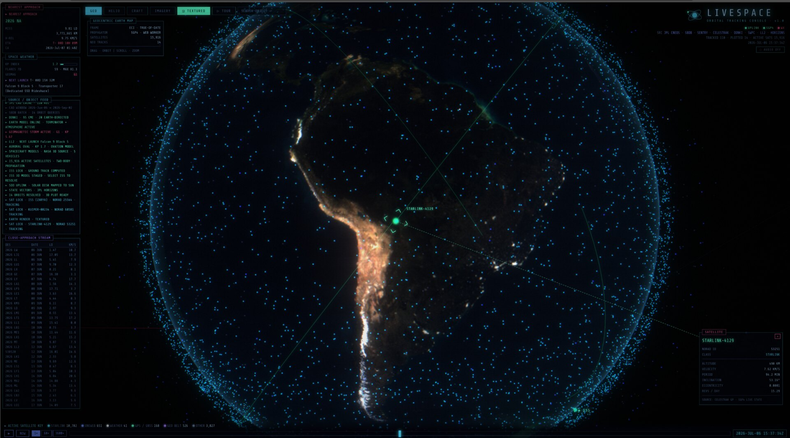

# LIVESPACE: Orbital Tracking Console

A browser-based space tracking console with a retro-CRT aesthetic, driven by live NASA/JPL data.

### 🚀 [Live demo → livespace-console.netlify.app](https://livespace-console.netlify.app)



## Running

```bash
npm install
npm run dev
```

Open `http://localhost:5173` in your browser. For a production build use `npm run build && npm run preview`.
(Because the JPL APIs do not send CORS headers, the app routes them through a Vite proxy;
both the `dev` and `preview` commands include that proxy.)

## Views

- **GEO** — Wireframe (or photoreal textured) Earth, ~13–16k active satellites with live
  SGP4 positions, the Moon, and geocentric approach tracks of incoming asteroids. Day/night
  terminator, atmospheric glow, and a live auroral oval driven by the Kp index.
- **HELIO** — The solar system: planet orbits, near-Earth-object orbits, CME particle fronts,
  and inner-system spacecraft. The Sun is textured with the latest live SDO solar disk.
- **CRAFT** — Wireframe spacecraft built from NASA's official 3D models
  (Voyager 1/2, Parker Solar Probe, Juno, Pioneer 10, ISS, Hubble, Cassini) plus the
  101955 Bennu asteroid shape model; deep-space craft show live range from JPL Horizons.
- **IMAGERY** — A dedicated full-screen, zoomable/pannable viewer for live NASA imagery:
  SDO solar channels (AIA 193 / AIA 304 / HMI) and the last 10 days of the Astronomy
  Picture of the Day, browsable with prev/next.

## Features

- **Search** — Type a satellite name or asteroid designation and press Enter (e.g. "HUBBLE", "2026 NA").
- **Cinematic camera** — Selecting any object flies the camera to it and keeps it framed
  (live tracking as it moves). A **TOUR** button auto-cycles a cinematic tour of highlights.
- **Targeting HUD** — Corner-bracket reticle that locks onto the selected object with a
  leader line to its data card.
- **Satellite focus** — Click any satellite point in GEO to lock it: name, NORAD ID, class,
  live altitude/velocity, period, inclination, and eccentricity. The full orbit ellipse is drawn.
- **ISS** — Shown as a bright point with its ground track; selecting it resolves the real 3D model.
- **Space weather panel** — Live Kp index (NOAA SWPC), solar flares over the last 7 days,
  geomagnetic storm status (DONKI), and the next rocket launch (Launch Library 2).
- **Time controls** — 1× / 60× / 3600× rates plus a ±7-day timeline scrubber; every position
  is recomputed for the selected instant.
- **Earth render toggle** — Switch between the wireframe and photoreal (Blue Marble day +
  city-lights night, blended by the terminator) globe.
- **Real star catalog** — 8,404 stars from the Yale Bright Star Catalogue, colored by B–V index.
- **Audio** — The AUDIO button (top right) enables ambient hum + event blips (off by default).

Scrubbing the bottom timeline shifts the simulation ±7 days. Clicking a row in the left
close-approach table selects that object, opens its detail card, and highlights its orbit in
both the GEO and HELIO views.

## Data sources

| Data | Source | Access |
|---|---|---|
| Close-approach asteroids | JPL CNEOS CAD API | proxy `/jpl-ssd` |
| Orbital elements | JPL SBDB API | proxy `/jpl-ssd` |
| Impact risk | JPL Sentry API | proxy `/jpl-ssd` |
| Satellite catalogue (TLE) | CelesTrak GP | direct (CORS open) |
| CME / flare / storm events | NASA DONKI | direct (CORS open) |
| Planetary Kp index | NOAA SWPC | direct (CORS open) |
| Craft state vectors | JPL Horizons | proxy `/jpl-horizons` |
| Solar imagery | NASA SDO | proxy `/sdo` |
| Astronomy Picture of the Day | NASA APOD | direct (CORS open) |
| Upcoming launches | Launch Library 2 | direct (CORS open) |
| Coastlines | Natural Earth 110m | bundled |
| Earth textures | NASA Blue Marble | bundled (`public/textures`) |
| Craft 3D models | NASA 3D Resources | bundled (`public/models`) |
| Star catalogue | Yale Bright Star Catalogue | bundled (`public/data/stars.json`) |

All API responses are cached in IndexedDB (TLE 6 h, CAD 6 h, SBDB 7 d, DONKI/Horizons 12 h).
If CelesTrak is unreachable, the bundled `public/data/tle-snapshot.txt` offline fallback kicks in.

DONKI, SDO, and APOD requests use an embedded NASA API key. To use your own, save it in the
browser console (localStorage takes precedence):

```js
localStorage.setItem('nasa_api_key', 'YOUR_KEY')
```

## Tech

Vanilla JavaScript + [Three.js](https://threejs.org) + [satellite.js](https://github.com/shashwatak/satellite-js)
(SGP4 in a Web Worker), bundled with [Vite](https://vitejs.dev). No framework, no backend —
everything runs client-side against public APIs.

## Development tools

```bash
node scripts/screenshot.mjs "http://localhost:5173/?view=helio" out.png 20000
```

The `?view=geo|helio|craft|imagery` query parameter picks the initial view.
